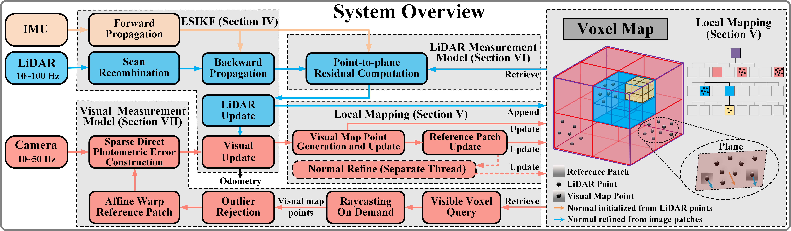

# FAST-LIVO2 ROS2 HUMBLE

## FAST-LIVO2: Fast, Direct LiDAR-Inertial-Visual Odometry

Thanks to hku mars lab chunran zheng for the open source excellent work

---

## About This Fork

This repository is maintained by the **Intelligent Agricultural Systems** research group at **Hochschule Osnabrück**. It is based on the ROS2 port by [integralrobotics](https://github.com/integralrobotics/FAST-LIVO2) and extends FAST-LIVO2 with bug fixes, new features, and a dedicated export mode for post-processing with [Global-LVBA](https://github.com/xuankuzcr/Global-LVBA).

### Source Repositories

| Component | Source |
|---|---|
| FAST-LIVO2 ROS2 port | https://github.com/integralrobotics/FAST-LIVO2 |
| Livox ROS2 Driver | https://github.com/Livox-SDK/livox_ros_driver2 |
| Livox SDK2 | https://github.com/Livox-SDK/Livox-SDK2 |
| rpg_vikit (ROS2) | https://github.com/integralrobotics/rpg_vikit |

---

### Bug Fixes

All fixes were validated on ROS2 Humble / Ubuntu 22.04.

**`main.cpp` — Initialization order**
`LIVMapper` was constructed after `ImageTransport`, leaving the ROS2 node pointer null during `ImageTransport` construction. Fixed by swapping declaration order. Caused SIGSEGV on shutdown with multi-camera setups.

**`LIVMapper.cpp` — Node not returned to caller**
The constructor created an internal `rclcpp::Node` but never wrote it back into the caller's `shared_ptr`. `ImageTransport` therefore held a null node. Fixed by adding `node = this->node` at the start of the constructor body.

**`LIVMapper.cpp::getImageFromMsg` — Use-after-free**
`cv_bridge::toCvShare` shares the ROS message buffer. With 4 simultaneous camera topics, the buffer is released immediately after the callback, corrupting images in VIO. Fixed by replacing with `toCvCopy`.

**`LIVMapper.cpp::savePCD` — `VoxelGrid` int32 overflow**
PCL `VoxelGrid` uses a dense int32 voxel index. At a leaf size of 0.15 m, this overflows silently for maps larger than roughly 350 m × 350 m, causing PCL to skip filtering entirely (65M unfiltered points → SIGSEGV while writing COLMAP output). Replaced with `ApproximateVoxelGrid` (hash-based, no overflow). Validated on a 430 m × 390 m Botanic Garden map.

**`LIVMapper.cpp::savePCD` — COLMAP output performance**
`std::endl` (stream flush per line) in the `points3D.txt` write loop made writing 10M+ points take many minutes, resulting in SIGKILL before completion. Replaced with `'\n'`.

**`vio.cpp::retrieveFromVisualSparseMap` — Null-pointer dereference**
`retrieve_voxel_points[i]` can be `nullptr` when the EKF state degenerates after an IMU/LiDAR sync gap. Added null-guard (`if (pt == nullptr) continue`). Caused SIGSEGV.

**`vio.cpp::updateState` / `updateStateInverse` — Heap buffer overflow**
When map points project outside the image (degenerate EKF state), the gradient stencil reads ±(patch_size_half+1) pixels beyond the image boundary. Added a depth check (`pf[2] > 0`) and a pixel bounds check before the stencil access. ASAN-confirmed out-of-bounds heap read.

---

### New Features

**Vibration-adaptive IMU covariance** (`IMU_Processing`)
Per-scan IMU variance is computed and used to scale `cov_acc` / `cov_gyr` at runtime via an EMA-smoothed gain (max 3×). Prevents EKF divergence on vibrating platforms (AGVs, drones). Enabled via `imu.vibration_adaptive_en`.

**Motion-detection during IMU init** (`IMU_Processing`)
Welford's algorithm computes per-axis variance during the initialization window. If significant motion is detected, initialization resets and retries (up to `max_init_retries_`, then proceeds anyway to avoid infinite init loops in dynamic environments).

**`pcd_save.save_raw_points`** (bool, default `false`)
Saves the unfiltered raw point cloud alongside the voxel-filtered output.

**`pcd_save.type`** (0 = world frame, 1 = body frame)
Selects the coordinate frame for saved PCD files. Body frame (type 1) is required for Global-LVBA export.

**Image saving** (`image_save.img_save_en`, `image_save.interval`)
Saves undistorted camera images per VIO frame together with a TUM-format pose file — required for Global-LVBA.

**Graceful shutdown timeouts** (`mapping_avia.launch.py`)
`sigterm_timeout=120 s`, `sigkill_timeout=60 s` — gives the process enough time to finish writing large PCD and COLMAP output files before the launcher escalates to SIGKILL.

**ARM aarch64 / 32-bit build support** (`CMakeLists.txt`)
Detects CPU architecture at configure time and selects optimized flags:
- aarch64 (Jetson Orin NX, RK3588): `-O3 -mcpu=native -mtune=native -ffast-math`
- ARM 32-bit: adds `-mfpu=neon`
- x86-64: `-O3 -march=native -mtune=native -funroll-loops`

---

### Supported Dataset Configurations

| Dataset | Main config | Camera config | Notes |
|---|---|---|---|
| [Botanic Garden](https://github.com/robot-pesg/BotanicGarden) | `botanical.yaml` | `camera_botanical.yaml` | Livox Avia + Xsens IMU + Dalsa RGB0 |
| [MARS-LVIG](https://mars.hku.hk/dataset.html) | `MARS_LVIG.yaml` | `camera_MARS_LVIG.yaml` | Aerial, per-sequence time offsets in config |
| FAST-LIVO2 generic Avia | `avia.yaml` | `camera_pinhole.yaml` | Upstream default |

---

## Installation

### Prerequisites

Install Livox SDK2 via CMake as described in the [Livox SDK2 README](https://github.com/Livox-SDK/Livox-SDK2/blob/master/README.md).

### Build

```bash
colcon build --symlink-install --packages-select livox_ros_driver2
colcon build --symlink-install --packages-select vikit_common vikit_ros vikit_py
colcon build --symlink-install --packages-select fast_livo
```

---

## ROS1 Bag to ROS2 Bag Conversion

```bash
pip install rosbags
rosbags-convert --src ~/fast-livo2-dataset/CBD_Building_01.bag --dst CBD_Building_01
```

Since this fork uses `livox_ros_driver2`, the message type in the converted bag must be updated:

```bash
sqlite3 CBD_Building_01/CBD_Building_01.db3
```
```sql
.tables
UPDATE topics
SET type = REPLACE(type, 'livox_ros_driver', 'livox_ros_driver2')
WHERE type LIKE '%livox_ros_driver%';
```

---

## Global-LVBA Export Mode

This fork adds a dedicated export mode that saves per-frame body-frame point clouds, camera images, and poses in the format required by [Global-LVBA](https://github.com/xuankuzcr/Global-LVBA) for LiDAR-visual bundle adjustment post-processing.

### Configuration (`config/avia.yaml`)

```yaml
pcd_save:
  pcd_save_en: true
  type: 1      # 0: World Frame (default), 1: Body Frame (required for Global-LVBA)
  interval: 1  # Save one PCD file per LiDAR scan

image_save:
  img_save_en: true
  interval: 1  # Save every VIO frame
```

### Output Structure

```
Log/
├── pcd/
│   ├── <timestamp>.pcd    # Per-frame LiDAR scans in body frame (PointXYZI)
│   └── lidar_poses.txt    # TUM format: timestamp tx ty tz qx qy qz qw
└── image/
    ├── <timestamp>.png    # Undistorted camera images
    └── image_poses.txt    # TUM format: timestamp tx ty tz qx qy qz qw
```

### Transferring Data to Global-LVBA

```bash
cp -r Log/pcd/   <global_lvba_ws>/dataset/<sequence>/all_pcd_body/
cp -r Log/image/ <global_lvba_ws>/dataset/<sequence>/all_image/
```

---

### 📢 News

- 🔓 **2025-01-23**: Code released!  
- 🎉 **2024-10-01**: Accepted by **T-RO '24**!  
- 🚀 **2024-07-02**: Conditionally accepted.

### 📬 Contact

If you have any questions, please feel free to contact: Chunran Zheng [zhengcr@connect.hku.hk](mailto:zhengcr@connect.hku.hk).

## 1. Introduction

FAST-LIVO2 is an efficient and accurate LiDAR-inertial-visual fusion localization and mapping system, demonstrating significant potential for real-time 3D reconstruction and onboard robotic localization in severely degraded environments.

<div align="center">
    
</div>

### 1.1 Related video

Our accompanying video is now available on [**Bilibili**](https://www.bilibili.com/video/BV1Ezxge7EEi) and [**YouTube**](https://youtu.be/6dF2DzgbtlY).

### 1.2 Related paper

[FAST-LIVO2: Fast, Direct LiDAR-Inertial-Visual Odometry](https://arxiv.org/pdf/2408.14035)  

[FAST-LIVO: Fast and Tightly-coupled Sparse-Direct LiDAR-Inertial-Visual Odometry](https://arxiv.org/pdf/2203.00893)

### 1.3 Our hard-synchronized equipment

We open-source our handheld device, including CAD files, synchronization scheme, STM32 source code, wiring instructions, and sensor ROS driver. Access these resources at this repository: [**LIV_handhold**](https://github.com/xuankuzcr/LIV_handhold).

### 1.4 Our associate dataset: FAST-LIVO2-Dataset
Our associate dataset [**FAST-LIVO2-Dataset**](https://connecthkuhk-my.sharepoint.com/:f:/g/personal/zhengcr_connect_hku_hk/ErdFNQtjMxZOorYKDTtK4ugBkogXfq1OfDm90GECouuIQA?e=KngY9Z) used for evaluation is also available online. **Please note that the dataset is being uploaded gradually.**

### MARS-LVIG dataset
[**MARS-LVIG dataset**](https://mars.hku.hk/dataset.html)：A multi-sensor aerial robots SLAM dataset for LiDAR-visual-inertial-GNSS fusion

## 2. Prerequisited

### 2.1 Ubuntu and ROS

Ubuntu 22.04.  [ROS Installation](http://wiki.ros.org/ROS/Installation).

### 2.2 PCL && Eigen && OpenCV

PCL>=1.6, Follow [PCL Installation](https://pointclouds.org/). 

Eigen>=3.3.4, Follow [Eigen Installation](https://eigen.tuxfamily.org/index.php?title=Main_Page).

OpenCV>=3.2, Follow [Opencv Installation](http://opencv.org/).

### 2.3 Sophus

Sophus Installation for the non-templated/double-only version.

```bash
git clone https://github.com/strasdat/Sophus.git
cd Sophus
git checkout a621ff
mkdir build && cd build && cmake ..
make
sudo make install
```

if build fails due to `so2.cpp:32:26: error: lvalue required as left operand of assignment`, modify the code as follows:

**so2.cpp**
```diff
namespace Sophus
{

SO2::SO2()
{
-  unit_complex_.real() = 1.;
-  unit_complex_.imag() = 0.;
+  unit_complex_.real(1.);
+  unit_complex_.imag(0.);
}
```

### 2.4 Vikit

Vikit contains camera models, some math and interpolation functions that we need. Vikit is a catkin project, therefore, download it into your catkin workspace source folder.

For well-known reasons, ROS2 does not have a direct global parameter server and a simple method to obtain the corresponding parameters. For details, please refer to https://discourse.ros.org/t/ros2-global-parameter-server-status/10114/11. I use a special way to get camera parameters in Vikit. While the method I've provided so far is quite simple and not perfect, it meets my needs. More contributions to improve `rpg_vikit` are hoped.

```bash
# Different from the one used in fast-livo1
cd fast_ws/src
git clone https://github.com/Robotic-Developer-Road/rpg_vikit.git 
```

Thanks to the following repositories for the code reference:

- [uzh-rpg/rpg_vikit](https://github.com/uzh-rpg/rpg_vikit)
- [xuankuzcr/rpg_vikit](https://github.com/xuankuzcr/rpg_vikit)
- [uavfly/vikit](https://github.com/uavfly/vikit)

### 2.5 **livox_ros_driver2**

Follow [livox_ros_driver2 Installation](https://github.com/Livox-SDK/livox_ros_driver2).

why not use `livox_ros_driver`? Because it is not compatible with ROS2 directly. actually i am not think there s any difference between [livox ros driver](https://github.com/Livox-SDK/livox_ros_driver.git) and [livox ros driver2](https://github.com/Livox-SDK/livox_ros_driver2.git) 's `CustomMsg`, the latter 's ros2 version is sufficient.

## 3. Build

Clone the repository and colcon build:

```
cd ~/fast_ws/src
git clone https://github.com/Robotic-Developer-Road/FAST-LIVO2.git
cd ../
colcon build --symlink-install --continue-on-error
source ~/fast_ws/install/setup.bash
```

## 4. Run our examples

Download our collected rosbag files via OneDrive ([**FAST-LIVO2-Dataset**](https://connecthkuhk-my.sharepoint.com/:f:/g/personal/zhengcr_connect_hku_hk/ErdFNQtjMxZOorYKDTtK4ugBkogXfq1OfDm90GECouuIQA?e=KngY9Z)). 

### convert rosbag

convert ROS1 rosbag to ROS2 rosbag
```bash
pip install rosbags
rosbags-convert --src Retail_Street.bag --dst Retail_Street
```
- [gitlab rosbags](https://gitlab.com/ternaris/rosbags)
- [pypi rosbags](https://pypi.org/project/rosbags/)

### change the msg type on rosbag

Such as dataset `Retail_Street.db3`, because we use `livox_ros2_driver2`'s `CustomMsg`, we need to change the msg type in the rosbag file. 
1. use `rosbags-convert` to convert rosbag from ROS1 to ROS2.
2. change the msg type of msg type in **metadata.yaml** as follows:

**metadata.yaml**
```diff
rosbag2_bagfile_information:
  compression_format: ''
  compression_mode: ''
  custom_data: {}
  duration:
    nanoseconds: 135470252209
  files:
  - duration:
      nanoseconds: 135470252209
    message_count: 30157
    path: Retail_Street.db3
    ..............
    topic_metadata:
      name: /livox/lidar
      offered_qos_profiles: ''
      serialization_format: cdr
-     type: livox_ros_driver/msg/CustomMsg
+     type: livox_ros_driver2/msg/CustomMsg
      type_description_hash: RIHS01_94041b4794f52c1d81def2989107fc898a62dacb7a39d5dbe80d4b55e538bf6d
    ...............
.....
```

### Run the demo

Do not forget to `source` your ROS2 workspace before running the following command.

```bash
ros2 launch fast_livo mapping_aviz.launch.py use_rviz:=True
ros2 bag play -p Retail_Street  # space bar controls play/pause
```

## 5. License

The source code of this package is released under the [**GPLv2**](http://www.gnu.org/licenses/) license. For commercial use, please contact me at <zhengcr@connect.hku.hk> and Prof. Fu Zhang at <fuzhang@hku.hk> to discuss an alternative license.